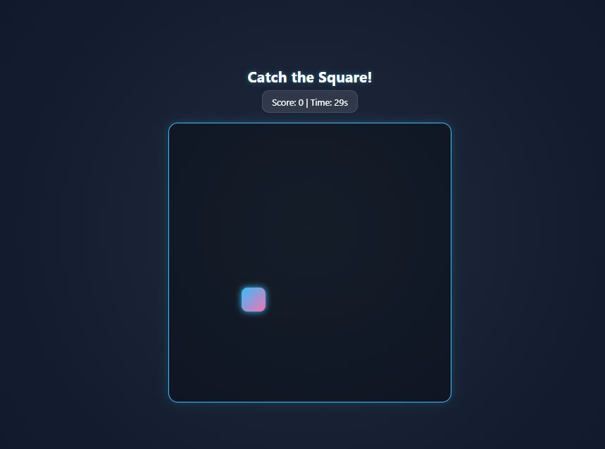

# 🎮 Catch the Square! – Interactive 2D Arcade Web Game

Welcome to **Catch the Square!**, a fast-paced, interactive 2D arcade reaction game engineered with vanilla web technologies. This project focuses on absolute real-time state manipulation, dynamic event handling matrices, and premium neon-glow UI layout rendering.

The objective is simple yet highly engaging: players must track and click a dynamically moving target canvas within a strict countdown timer to maximize their efficiency score points.

---

## 🤵 Repository Host Details

- **Author Name:** amir
- **GitHub Profile Alias:** [amirsohail100](https://github.com/amirsohail100)
- **Official Communication Endpoints:** amirsoahil10@gmail.com
- **Project Status:** Production Ready & Operational 🟢

---

## 🖥️ Application User Interface Preview

Below is the live execution interface snapshot capturing the glowing main bounding grid arena, structural text score layouts, and active countdown loops from the workspace:

<!-- Game Core UI Display Section -->
<div align="center">
  
  <p><i>Gameplay Interface — Core Neon Grid Layout tracking dynamic user parameters</i></p>
</div>

---

## 🛠️ Core Features & Engineering Objectives

- **Dynamic Randomized Spawning:** Built explicit mathematical coordinate formulas (`Math.random()`) in JavaScript to calculate fresh, bounding pixel margins for the target square inside the grid.
- **Real-Time State Mechanics:** Programmed precise click triggers to synchronously increment the active dashboard scoring system upon registering target node hits.
- **Asynchronous Countdown Clock:** Utilizes intervals (`setInterval`) to run a smooth temporal matrix tracking game-over states and session limits.
- **Modern Premium Styling UI:** Applied custom CSS variables, rounded corner vectors, active flex alignment properties, and subtle radial shadows to construct a rich dashboard atmosphere.

---

## 💻 Tech Stack & Architecture

- **Structural Layer:** HTML5 Semantic Layout Elements
- **Visual Styling Array:** Custom CSS3 Styles (Neon Borders, Dark Theme Configurations, Variable Spacing)
- **Logic & Event Engine:** Vanilla ES6+ JavaScript (Dynamic Styling Modifiers, Event Propagation Loops)

---

## 🚀 How to Play Locally

Follow these basic guidelines to spin up the arcade environment smoothly on your local machine:

### 1. Clone the Target Endpoint

```bash
git clone [https://github.com/amirsohail100/your-game-repo-name.git](https://github.com/amirsohail100/your-game-repo-name.git)
cd your-game-repo-name
```
